# Hệ thống điều khiển nhà thông minh dựa trên mô hình Pub-Sub


## Giao diện hệ thống

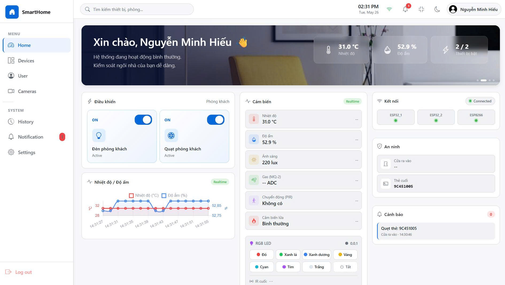

Hình trên là giao diện Web Dashboard của hệ thống nhà thông minh, cho phép người dùng giám sát dữ liệu cảm biến, trạng thái kết nối, cảnh báo và điều khiển thiết bị trong thời gian thực.

## Giới thiệu

Đây là dự án xây dựng hệ thống điều khiển và giám sát nhà thông minh dựa trên mô hình **Publish-Subscribe**, sử dụng **Raspberry Pi**, **ESP32/ESP8266**, **MQTT**, **Node.js**, **SQLite** và **Telegram Bot**.

Hệ thống cho phép thu thập dữ liệu cảm biến theo thời gian thực, điều khiển thiết bị điện, giám sát trạng thái cửa, phát hiện khí gas/lửa, lưu trữ dữ liệu vào cơ sở dữ liệu SQLite và gửi cảnh báo từ xa thông qua Telegram.

Dự án được thực hiện phục vụ khóa luận tốt nghiệp với đề tài:

> **Thiết kế hệ thống điều khiển nhà thông minh dựa trên mô hình Pub-Sub**

---

## Demo giao diện

> Bản demo GitHub Pages chỉ dùng để mô phỏng giao diện Web Dashboard.  
> Demo này không kết nối trực tiếp với Raspberry Pi, MQTT Broker hoặc phần cứng thật.

- **Live Demo:** `https://nguyenminhhieu1803-tech.github.io/smart-home-pubsub-system/`
- **Source Code:** `https://github.com/nguyenminhhieu1803-tech/smart-home-pubsub-system`

---

## Tính năng chính

| Chức năng | Mô tả |
|---|---|
| Giám sát thời gian thực | Hiển thị nhiệt độ, độ ẩm, ánh sáng, chuyển động, khí gas, lửa, RFID và trạng thái cửa |
| Điều khiển thiết bị | Điều khiển đèn, quạt, relay và RGB LED từ Web Dashboard |
| Giao tiếp MQTT | Sử dụng Mosquitto MQTT Broker theo mô hình Publish-Subscribe |
| Cảnh báo tại biên | Node bếp có thể tự kích hoạt relay/còi khi phát hiện gas hoặc lửa |
| Cảnh báo Telegram | Gửi thông báo khi có sự kiện bất thường như gas, lửa, mở cửa hoặc quét thẻ sai |
| Lưu trữ dữ liệu | Dữ liệu cảm biến được lưu vào SQLite |
| Web Dashboard | Giao diện giám sát và điều khiển chạy trên Raspberry Pi |
| Tự khởi động hệ thống | Server Node.js có thể chạy tự động bằng systemd khi Raspberry Pi khởi động |

---

## Kiến trúc tổng thể hệ thống

Hệ thống gồm một máy chủ trung tâm Raspberry Pi và ba node phần cứng.

```text
Người dùng / Trình duyệt Web
            |
            | HTTP / WebSocket
            v
Raspberry Pi 4 Model B
            |
            |-- Mosquitto MQTT Broker
            |-- Node.js Server
            |-- SQLite Database
            |-- Web Dashboard
            |
            | MQTT Publish/Subscribe
            v
+--------------------------+
| ESP32 phòng khách        |
| ESP8266 khu vực bếp      |
| ESP32 khu vực cửa        |
+--------------------------+
```

---

## Thành phần phần cứng

| Khu vực | Vi điều khiển | Cảm biến / Thiết bị |
|---|---|---|
| Phòng khách | ESP32 DevKit V1 | DHT22, BH1750, PIR HC-SR501, IR Receiver VS1838, RGB LED, relay 2 kênh |
| Khu vực bếp | ESP8266 NodeMCU | MQ-2, KY-032, buzzer, relay |
| Khu vực cửa | ESP32 DevKit V1 | RFID RC522, cảm biến từ MC-38, buzzer |
| Máy chủ trung tâm | Raspberry Pi 4 Model B | Mosquitto MQTT Broker, Node.js Server, SQLite, Web Dashboard |

---

## Thành phần phần mềm

| Thành phần | Vai trò |
|---|---|
| Raspberry Pi OS | Hệ điều hành chạy trên Raspberry Pi |
| Mosquitto MQTT Broker | Trung gian truyền nhận bản tin MQTT |
| Node.js | Xây dựng server xử lý dữ liệu và điều khiển |
| SQLite | Lưu trữ dữ liệu cảm biến và lịch sử hệ thống |
| HTML/CSS/JavaScript | Xây dựng giao diện Web Dashboard |
| Telegram Bot API | Gửi cảnh báo từ xa đến người dùng |
| Arduino IDE | Lập trình firmware cho ESP32/ESP8266 |

---

## Mô hình Publish-Subscribe

Hệ thống sử dụng MQTT theo mô hình Publish-Subscribe. Các node cảm biến đóng vai trò **Publisher**, gửi dữ liệu lên MQTT Broker. Server Node.js đóng vai trò **Subscriber**, nhận dữ liệu, xử lý, lưu vào SQLite và cập nhật lên Web Dashboard.

Khi người dùng điều khiển thiết bị từ dashboard, server sẽ publish lệnh điều khiển đến topic tương ứng. Node phần cứng subscribe topic lệnh và thực hiện bật/tắt thiết bị.

```text
ESP32/ESP8266  ---> Publish dữ liệu cảm biến --->  Mosquitto Broker
Node.js Server ---> Subscribe dữ liệu ----------->  Xử lý và lưu SQLite
Web Dashboard  ---> Gửi lệnh điều khiển -------->  Node.js Server
Node.js Server ---> Publish lệnh MQTT ---------->  ESP32/ESP8266
```

---

## Cấu trúc MQTT Topic

Ví dụ cấu trúc topic:

```text
home/<node>/<group>/<name>
```

Một số topic sử dụng trong hệ thống:

| Topic | Ý nghĩa |
|---|---|
| `home/esp32_1/sensor/temp` | Nhiệt độ phòng khách |
| `home/esp32_1/sensor/hum` | Độ ẩm phòng khách |
| `home/esp32_1/sensor/light` | Cường độ ánh sáng |
| `home/esp32_1/sensor/pir` | Trạng thái phát hiện chuyển động |
| `home/esp32_1/cmd/relay1` | Lệnh điều khiển đèn |
| `home/esp32_1/cmd/relay2` | Lệnh điều khiển quạt |
| `home/esp8266_1/sensor/gas` | Giá trị cảm biến khí gas |
| `home/esp8266_1/sensor/flame` | Trạng thái cảm biến lửa |
| `home/esp8266_1/alert` | Cảnh báo khu vực bếp |
| `home/esp32_2/sensor/rfid` | UID thẻ RFID |
| `home/esp32_2/sensor/door` | Trạng thái cửa |
| `home/esp32_2/cmd/buzzer` | Lệnh điều khiển còi cảnh báo |

---

## Cấu trúc thư mục

```text
smart-home-pubsub-system/
├── server/                     # Mã nguồn Node.js Server
├── public/                     # Giao diện Web Dashboard thật
├── data/                       # Cơ sở dữ liệu và file cấu hình
│   └── settings.example.json   # File cấu hình mẫu
├── firmware/                   # Firmware cho các node ESP32/ESP8266
│   ├── esp32_livingroom/
│   ├── esp8266_kitchen/
│   └── esp32_door/
├── docs/                       # Demo giao diện tĩnh cho GitHub Pages
├── assets/
│   ├── images/                 # Ảnh dashboard, phần cứng, Telegram
│   └── diagrams/               # Sơ đồ hệ thống, sơ đồ MQTT
├── README.md
├── .gitignore
├── package.json
└── package-lock.json
```

---

## Hướng dẫn cài đặt trên Raspberry Pi

### 1. Clone repository

```bash
git clone https://github.com/nguyenminhhieu1803-tech/smart-home-pubsub-system.git
cd smart-home-pubsub-system
```

### 2. Cài đặt thư viện Node.js

```bash
npm install
```

### 3. Chuẩn bị file cấu hình

```bash
cp data/settings.example.json data/settings.json
nano data/settings.json
```

Cập nhật các thông tin:

```json
{
  "telegram": {
    "token": "YOUR_TELEGRAM_BOT_TOKEN",
    "chat_id": "YOUR_TELEGRAM_CHAT_ID"
  },
  "mqtt": {
    "host": "localhost"
  }
}
```

### 4. Khởi động Mosquitto MQTT Broker

```bash
sudo systemctl enable mosquitto
sudo systemctl start mosquitto
sudo systemctl status mosquitto
```

### 5. Chạy server Node.js

```bash
node server/server.js
```

Sau khi chạy thành công, truy cập dashboard tại:

```text
http://<IP_RASPBERRY_PI>:3000
```

Ví dụ:

```text
http://192.168.1.100:3000
```

---

## Chạy tự động bằng systemd

Tạo service:

```bash
sudo nano /etc/systemd/system/smarthome.service
```

Nội dung mẫu:

```ini
[Unit]
Description=SmartHome Dashboard Server
After=network-online.target mosquitto.service
Wants=network-online.target mosquitto.service

[Service]
Type=simple
User=hieu
WorkingDirectory=/home/hieu/iot-dashboard
ExecStart=/usr/bin/node /home/hieu/iot-dashboard/server/server.js
Restart=always
RestartSec=5
Environment=NODE_ENV=production

[Install]
WantedBy=multi-user.target
```

Kích hoạt service:

```bash
sudo systemctl daemon-reload
sudo systemctl enable smarthome
sudo systemctl start smarthome
sudo systemctl status smarthome --no-pager
```

Xem log khi cần kiểm tra lỗi:

```bash
journalctl -u smarthome -f
```

---

## Firmware cho các node

Firmware của các node phần cứng được đặt trong thư mục `firmware/`.

| Thư mục | Chức năng |
|---|---|
| `firmware/esp32_livingroom` | Code cho ESP32 khu vực phòng khách |
| `firmware/esp8266_kitchen` | Code cho ESP8266 khu vực bếp |
| `firmware/esp32_door` | Code cho ESP32 khu vực cửa |

Trước khi nạp code, cần chỉnh lại:

```text
Wi-Fi SSID
Wi-Fi Password
MQTT Host
MQTT Port
Tên node
Các chân GPIO
```

---

## Hình ảnh minh họa

### Giao diện đăng nhập

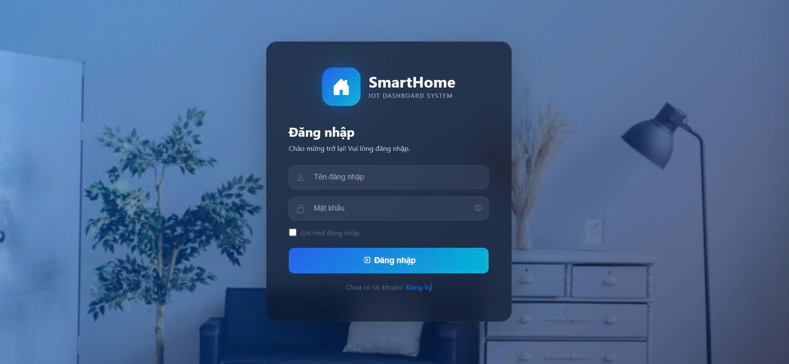

### Giao diện tổng quan Dashboard


### Giao diện điều khiển thiết bị

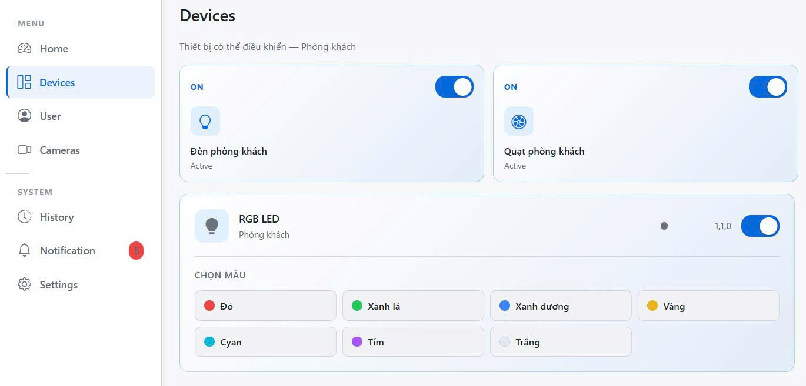

### Giao diện lịch sử dữ liệu

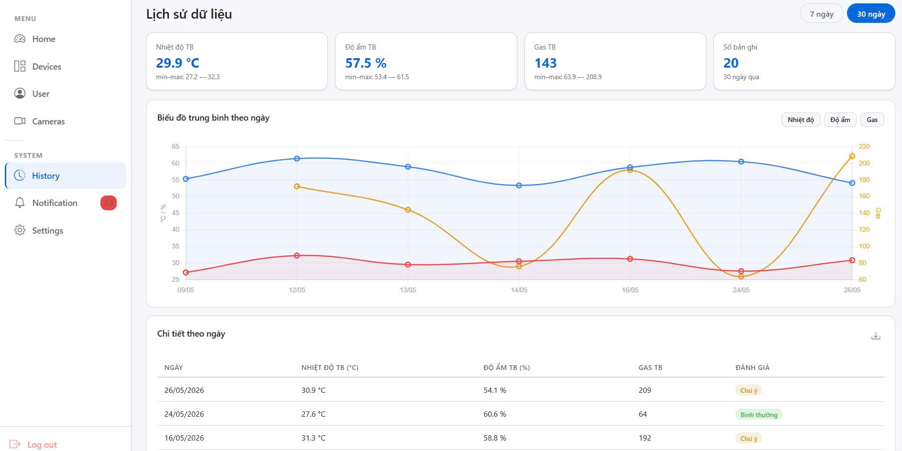

### Dữ liệu cảm biến thời gian thực

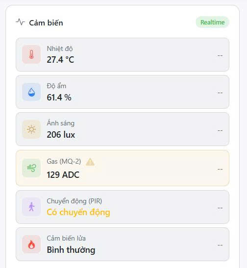

### Cấu hình ngưỡng cảnh báo

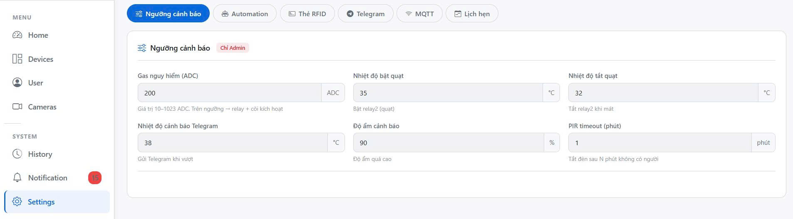

### Sơ đồ kiến trúc tổng thể hệ thống

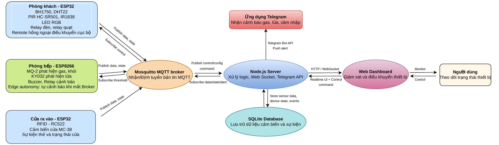

### Sơ đồ khối phần cứng

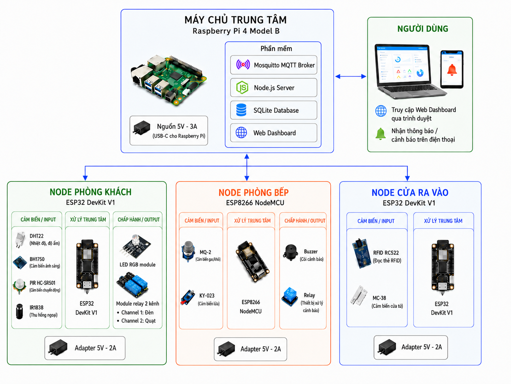

### Sơ đồ MQTT Topic

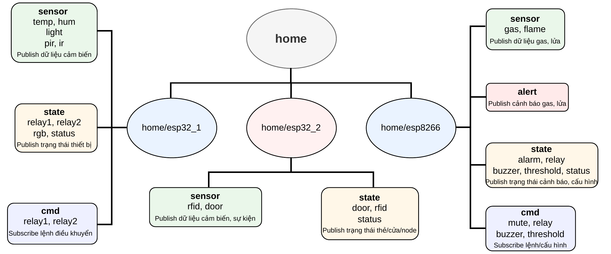

### Lưu đồ Node.js Server

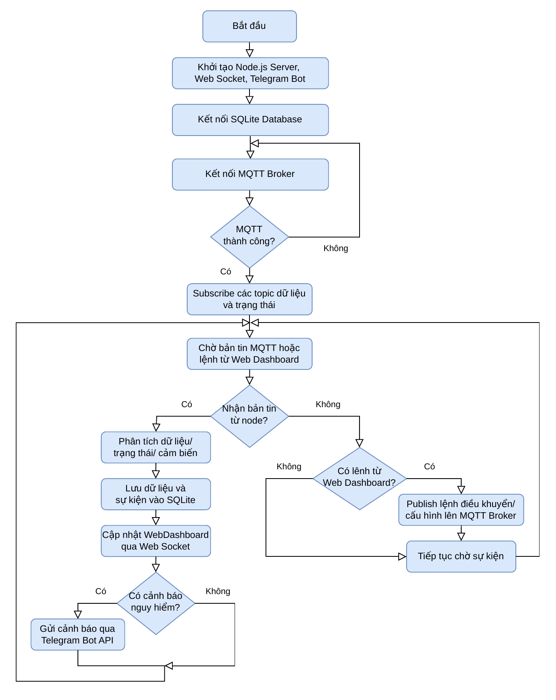

### Lưu đồ node phòng khách

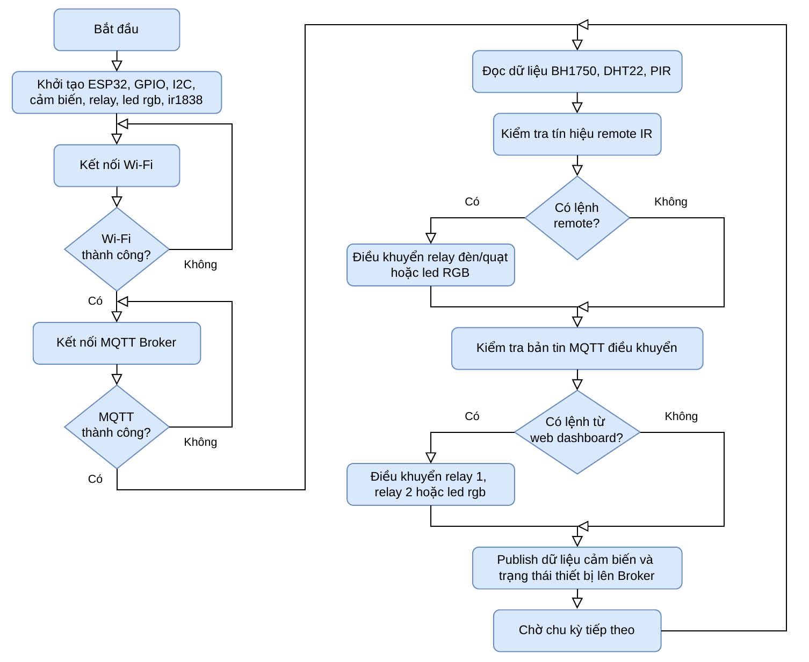

### Lưu đồ node bếp

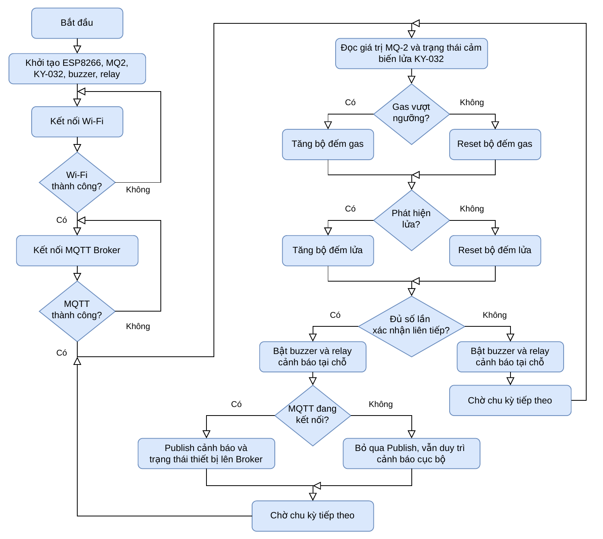

### Lưu đồ node cửa

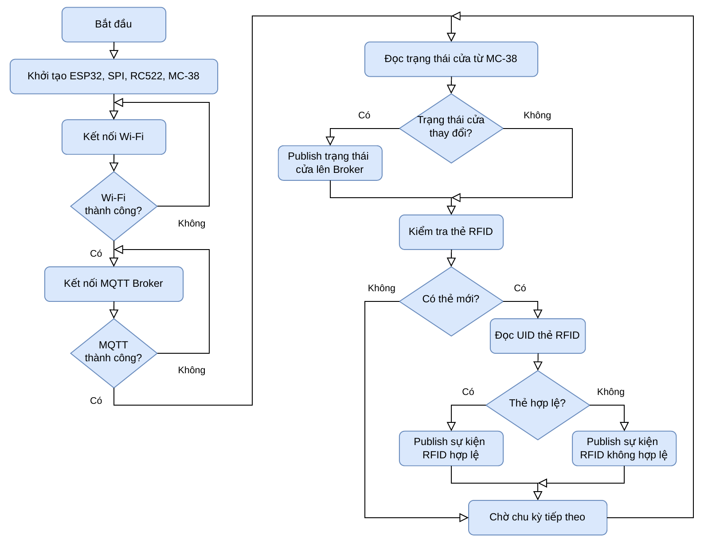

### Mô hình phần cứng tổng thể

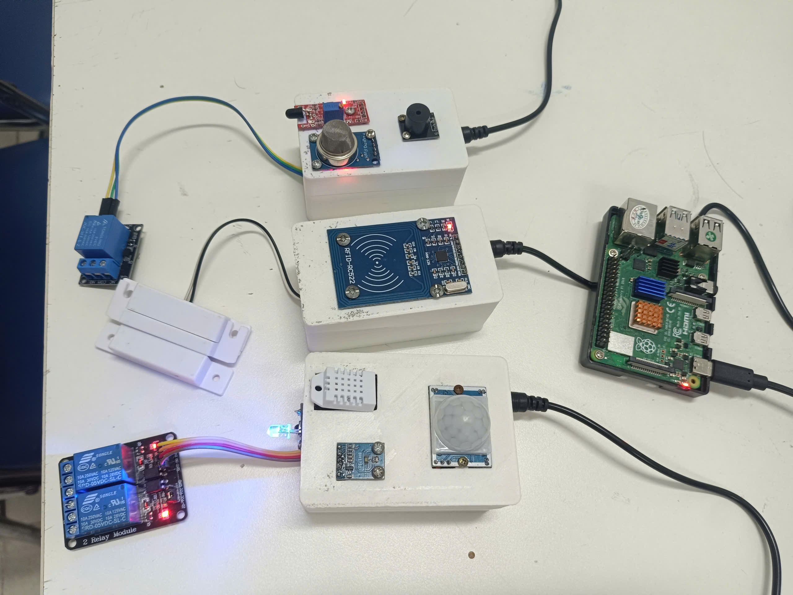

### Node phòng khách

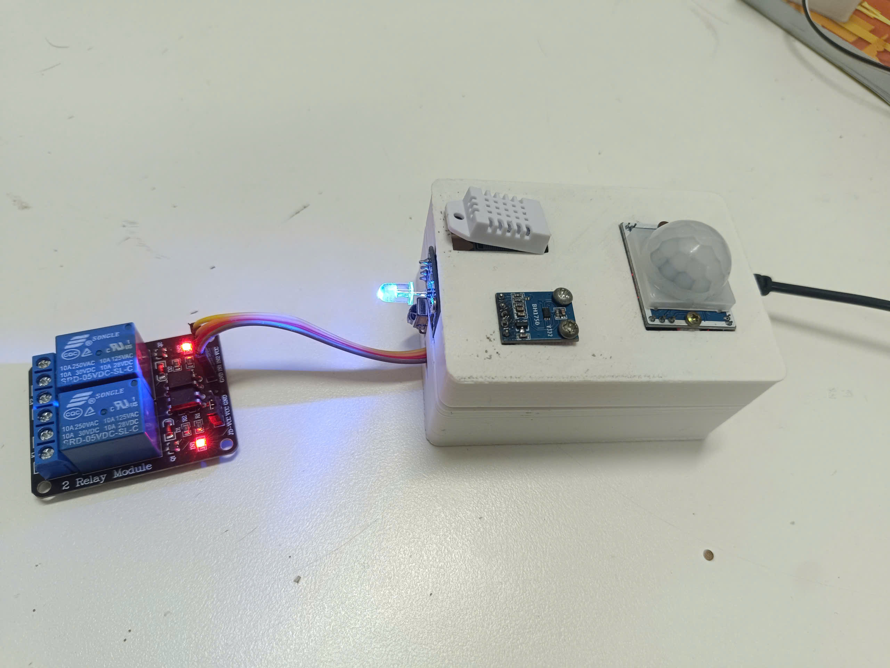

### Node bếp

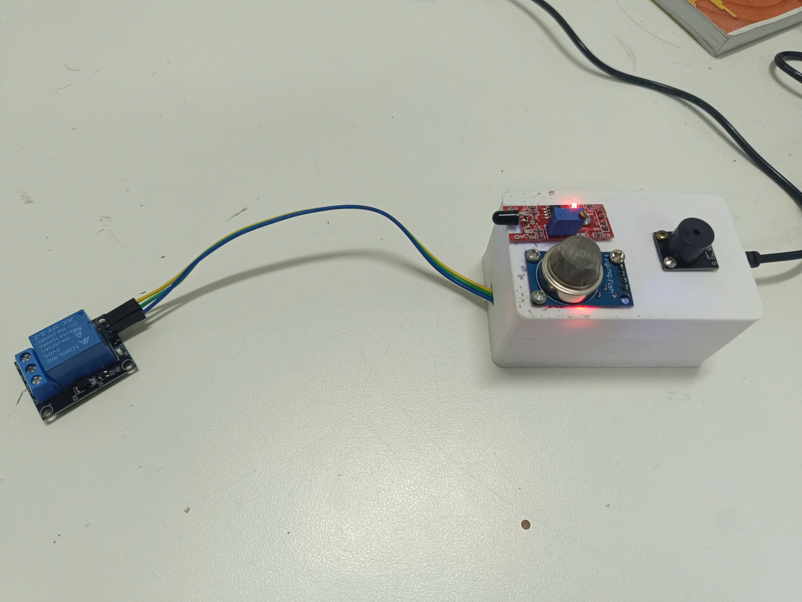

### Node cửa

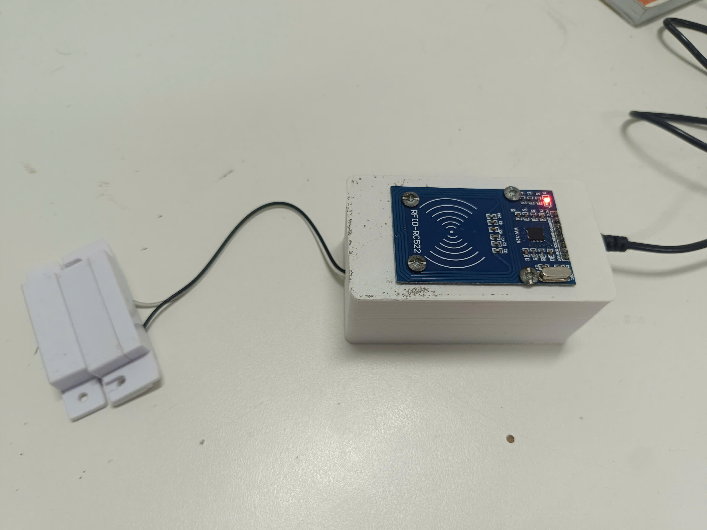

### Cảnh báo Telegram

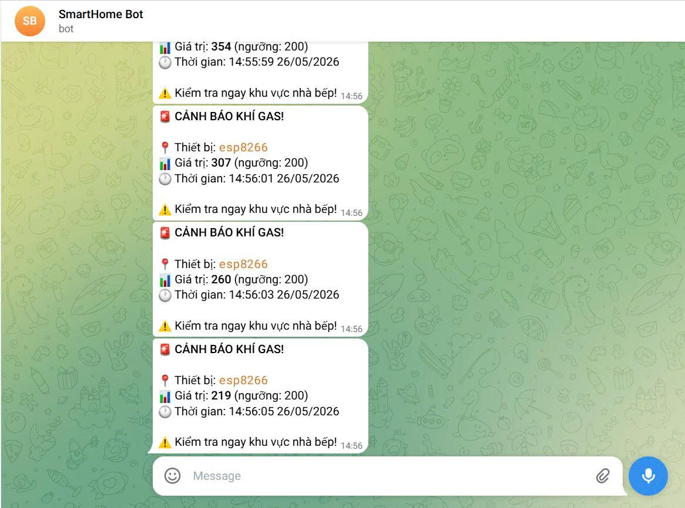

---

## Kiểm thử hệ thống

Một số nội dung kiểm thử chính:

| Nội dung kiểm thử | Kết quả mong muốn |
|---|---|
| Kết nối MQTT | Node ESP32/ESP8266 gửi dữ liệu thành công về Mosquitto |
| Hiển thị dashboard | Dữ liệu cảm biến cập nhật theo thời gian thực |
| Điều khiển relay | Bật/tắt thiết bị từ giao diện Web |
| Cảnh báo gas/lửa | Node bếp kích hoạt buzzer/relay và gửi cảnh báo |
| Cảnh báo RFID sai | Quét sai thẻ nhiều lần sẽ gửi cảnh báo |
| Lưu dữ liệu SQLite | Dữ liệu cảm biến được ghi vào database |
| Tự khởi động | Server tự chạy lại sau khi Raspberry Pi khởi động |

---

## Ghi chú bảo mật

Không đưa các file sau lên GitHub:

```text
data/settings.json
.env
database.sqlite
database.db
node_modules/
secrets.h
wifi_config.h
```

Không công khai:

```text
Telegram Bot Token
Telegram Chat ID
Mật khẩu Wi-Fi
Database thật
Thông tin IP hoặc cấu hình riêng của hệ thống
```

Nếu repository để Public, cần kiểm tra kỹ toàn bộ file trước khi push.

---

## Hướng phát triển

- Bổ sung xác thực người dùng và phân quyền chi tiết hơn.
- Thêm MQTT username/password.
- Bổ sung TLS cho MQTT khi triển khai qua Internet.
- Thiết kế vỏ hộp và PCB cho các node cảm biến.
- Tối ưu thuật toán cảnh báo gas/lửa để giảm cảnh báo sai.
- Bổ sung biểu đồ lịch sử dữ liệu cảm biến.
- Bổ sung camera giám sát và xử lý ảnh.
- Triển khai dashboard lên cloud hoặc dùng VPN để truy cập từ xa an toàn.

---

## Tác giả

**Nguyễn Minh Hiếu**

Đề tài khóa luận tốt nghiệp:

**Thiết kế hệ thống điều khiển nhà thông minh dựa trên mô hình Pub-Sub**
